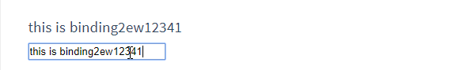
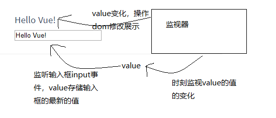

## Vue源码解析（二）Vue的双向绑定讲解及实现

上篇文章，我们讲解了Vue的data属性映射和方法的重定义，这篇文章给大家带来的是Vue的双向绑定讲解。<br>
首先介绍下Vue的双向绑定是什么？<br>
我们看一张图：<br>
<br>
可以看到，输入框上方的内同和输入框中的值是一致的。输入框的之变化，上方的值跟着一起变化。<br>
这就是Vue的双向绑定。，我们先不着急了解Vue时如何实现这一功能的，如果我们自己要实现这样的功能，如何实现呢？<br>
我的思路是这样：<br>
<br>
可以分为几个步骤，如下:<br>

1、首先给输入框添加input事件，监视输入值，存放在变量value中。<br>

2、监视value变量，确保value变化时，监视器可以发现。<br>

3、若value发生变化，则重新渲染视图。<br>

上面三个步骤，1（addEventListener）和3（操作dom）都很好实现，对于2的实现，可能有一下两个方案：<br>

1、使用Object.defineProperty()重新定义对象set和get，在值发生变化时，通知订阅者。<br>
2、使用定时器定时检查value的值，发生变化就通知订阅者。(这个方法不好，定时器不能实时反应value变化)。<br>

Vue源码中采用了方案1，我们首先用方案1实现对对象值的监听，代码如下：
```javascript
function defineReactive(obj, key, val, customSetter) {
  //获取对象给定属性的描述符
  let property = Object.getOwnPropertyDescriptor(obj, key);
  //对象该属性不可配置，直接返回
  if (property && property.configurable === false) {
    return;
  }

  //获取属性get和set属性，若此前该属性已经进行监听，则确保监听属性不会被覆盖
  let getter = property && property.get;
  let setter = property && property.set;
  
  if (arguments.length < 3) {
    val = obj[key];
  }

  //监听属性
  Object.defineProperty(obj, key, {
    enumerable: true,
    configurable: true,
    get: function reactiveGetter () {
      const value = getter ? getter.call(obj) : val;
      console.log(`读取了${key}属性`);
      return value;
    },
    set: function reactiveSetter (newVal) {
      const value = getter ? getter.call(obj) : val;
      //如果值没有变化，则不做改动
      if (newVal === value) {
        return;
      }
      //自定义响应函数
      if (customSetter) {
        customSetter(newVal);
      }
      if (setter) {
        setter.call(obj, newVal);
      } else {
        val = newVal;
      }
      console.log(`属性${key}发生变化:${value} => ${newValue}`);
    }
  })
}
```
下面我们测试下，测试代码如下：
```javascript
let obj = {
    name: 'xxx',
    age: 20
};
defineReactive(obj, 'name');
let name = obj.name;
obj.name = '1111';
```
控制台输出为： 
```
读取了name属性
test.html:51 属性name发生变化:xxx => 1111
```
可见，我们已经实现了对obj对象name属性读和写的监听。