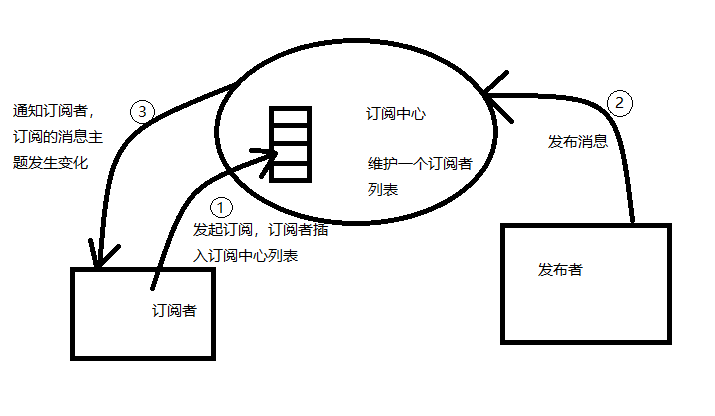
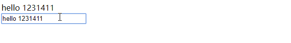

## Vue源码解析（二）Vue的双向绑定讲解及实现
git项目地址：https://github.com/xubaodian/SimuVue<br>
项目使用webpack构建，下载后先执行：
```
npm install
```
安装依赖后使用指令：
```
npm run dev
```
可以运行项目。<br>

上篇文章，我们讲解了Vue的data属性映射和方法的重定义，这篇文章给大家带来的是Vue的双向绑定讲解。<br>
### **什么是双向绑定**<br>
我们看一张图：<br>
<br>
可以看到，输入框上方的内同和输入框中的值是一致的。输入框的之变化，上方的值跟着一起变化。<br>
这就是Vue的双向绑定。<br>

### **对象属性监听实现**

我们先不着急了解Vue时如何实现这一功能的，如果我们自己要实现这样的功能，如何实现呢？<br>
我的思路是这样：<br>
<br>
可以分为几个步骤，如下:<br>

1、首先给输入框添加input事件，监视输入值，存放在变量value中。<br>

2、监视value变量，确保value变化时，监视器可以发现。<br>

3、若value发生变化，则重新渲染视图。<br>

上面三个步骤，1（addEventListener）和3（操作dom）都很好实现，对于2的实现，可能有一下两个方案：<br>

1、使用Object.defineProperty()重新定义对象set和get，在值发生变化时，通知订阅者。<br>
2、使用定时器定时检查value的值，发生变化就通知订阅者。(这个方法不好，定时器不能实时反应value变化)。<br>

Vue源码中采用了方案1，我们首先用方案1实现对对象值的监听，代码如下：
```javascript
function defineReactive(obj, key, val, customSetter) {
  //获取对象给定属性的描述符
  let property = Object.getOwnPropertyDescriptor(obj, key);
  //对象该属性不可配置，直接返回
  if (property && property.configurable === false) {
    return;
  }

  //获取属性get和set属性，若此前该属性已经进行监听，则确保监听属性不会被覆盖
  let getter = property && property.get;
  let setter = property && property.set;
  
  if (arguments.length < 3) {
    val = obj[key];
  }

  //监听属性
  Object.defineProperty(obj, key, {
    enumerable: true,
    configurable: true,
    get: function reactiveGetter () {
      const value = getter ? getter.call(obj) : val;
      console.log(`读取了${key}属性`);
      return value;
    },
    set: function reactiveSetter (newVal) {
      const value = getter ? getter.call(obj) : val;
      //如果值没有变化，则不做改动
      if (newVal === value) {
        return;
      }
      //自定义响应函数
      if (customSetter) {
        customSetter(newVal);
      }
      if (setter) {
        setter.call(obj, newVal);
      } else {
        val = newVal;
      }
      console.log(`属性${key}发生变化:${value} => ${newValue}`);
    }
  })
}
```
下面我们测试下，测试代码如下：
```javascript
let obj = {
    name: 'xxx',
    age: 20
};
defineReactive(obj, 'name');
let name = obj.name;
obj.name = '1111';
```
控制台输出为： 
```
读取了name属性
test.html:51 属性name发生变化:xxx => 1111
```
可见，我们已经实现了对obj对象name属性读和写的监听。<br>

实现了监听，这没问题，但是视图怎么知道这些属性发生了变化呢？可以使用发布订阅模式实现。

### **发布订阅模式**
什么是发布订阅模式呢？<br>
我画了一个示意图，如下：
<br>
发布订阅模式有几个部分构成：<br>
1、订阅中心，管理订阅者列表，发布者发消息时，通知相应的订阅者。<br>
2、订阅者，这个是订阅消息的主体，就像关注微信公众号一样，有文章就会通知关注者。<br>
3、发布者，类似微信公众号的文章发布者。<br>
订阅中心的代码如下：
```javascript
export class Dep {
  constructor() {
    this.id = uid++;
    //订阅列表
    this.subs = [];
  }

  //添加订阅
  addSub(watcher) {
    this.subs.push(watcher);
  }

  //删除订阅者
  remove(watcher) {
    let index = this.subs.findIndex(item => item.id === watcher.id);
    if (index > -1) {
      this.subs.splice(index, 1);
    }
  }


  depend () {
    if (Dep.target) {
      Dep.target.addDep(this);
    }
  }

//通知订阅者
  notify() {
    this.subs.map(item => {
      item.update();
    });
  }
}

//订阅中心  静态变量，订阅时使用
Dep.target = null;
const targetStack = [];

export function pushTarget (target) {
  targetStack.push(target);
  Dep.target = target;
}

export function popTarget () {
  targetStack.pop();
  Dep.target = targetStack[targetStack.length - 1];
}
```
订阅中心已经实现，还有发布者和订阅者，先看下发布者，这里谁是发布者呢？<br>
没错，就是defineReactive函数，这个函数实现了对data属性的监听，它可以检测到data属性的修改，发生修改时，通知订阅中心，所以defineReactive做一些修改，如下：<br>
```javascript
//属性监听
export function defineReactive(obj, key, val, customSetter) {
  //获取对象给定属性的描述符
  let property = Object.getOwnPropertyDescriptor(obj, key);
  //对象该属性不可配置，直接返回
  if (property && property.configurable === false) {
    return;
  }

  //订阅中心
  const dep = new Dep();

  //获取属性get和set属性，若此前该属性已经进行监听，则确保监听属性不会被覆盖
  let getter = property && property.get;
  let setter = property && property.set;
  
  if (arguments.length < 3) {
    val = obj[key];
  }

  //如果监听的是一个对象，继续深入监听
  let childOb = observe(val);
  //监听属性
  Object.defineProperty(obj, key, {
    enumerable: true,
    configurable: true,
    get: function reactiveGetter () {
      const value = getter ? getter.call(obj) : val;
      //这段代码时添加订阅时使用的
      if (Dep.target) {
        dep.depend();
        if (childOb) {
          childOb.dep.depend();
        }
      }
      return value;
    },
    set: function reactiveSetter (newVal) {
      const value = getter ? getter.call(obj) : val;
      //如果值没有变化，则不做改动
      if (newVal === value) {
        return;
      }
      //自定义响应函数
      if (customSetter) {
        customSetter(newVal);
      }
      if (setter) {
        setter.call(obj, newVal);
      } else {
        val = newVal;
      }
      //如果新的值为对象，重新监听
      childOb = observe(newVal);
      /**
       * 订阅中心通知所有订阅者
       **/
      dep.notify();
    }
  })
}
```
这里设计到闭包的概念，我们在函数里定义了：
```javascript
 const dep = new Dep();
```
由于set和get函数一直都存在的，所有dep会一直存在，不会被回收。<br>
当值发生变化后，利用下面的代码通知订阅者：
```javascript
dep.notify();
```
订阅中心和发布者都有了，我们何时订阅呢？或者什么时间订阅合适呢？<br>
我们是希望实现当读取data属性时候，实现订阅。所以在defineReactive函数的get监听中添加了如下代码：
```javascript
    if (Dep.target) {
        dep.depend();
        if (childOb) {
          childOb.dep.depend();
        }
    }
    return value;
```
Dep.target是一个静态变量，用来存储订阅者的，每次订阅前指向订阅者，订阅者置为null。<br>
订阅者代码如下：
```javascript
let uid = 0;
//订阅者类
export class Watcher{
  //构造器，vm是vue实例
  constructor(vm, expOrFn, cb) {
    this.vm = vm;
    this.cb = cb;
    this.id = uid++;
    this.deps = [];
    if (typeof expOrFn === 'function') {
      this.getter = expOrFn
    } else {
      this.getter = parsePath(expOrFn)
    }
    this.value = this.get();
  }

  //将订阅这添加到订阅中心
  get() {
    //订阅前，设置Dep.target变量，指向自身
    pushTarget(this)
    let value;
    const vm = this.vm;
    /**
     * 这个地方读取data属性，触发下面的订阅代码，
     *  if (Dep.target) {
     *      dep.depend();
     *     if (childOb) {
     *       childOb.dep.depend();
     *     }
     *   }
     *   return value;
     **/
    value = this.getter.call(vm, vm);
    //订阅后，置Dep.target为null
    popTarget();
    return value
  }

  //值变化，调用回调函数
  update() {
    this.cb(this.value);
  }

  //添加依赖
  addDep(dep) {
    this.deps.push(dep);
    dep.addSub(this);
  }
}

//解析类属性的路径，例如obj.sub.name，返回实际的值
export function parsePath (path){
  const segments = path.split('.');
  return function (obj) {
    for (let i = 0; i < segments.length; i++) {
      if (!obj) return;
      obj = obj[segments[i]];
    }
    return obj;
  }
}
```
除了发布订阅以外，双向绑定还需要编译dom。<br>
主要实现两个功能： <br>
1、将dom中的{{key}}元素替换为Vue中的属性。<br>
2、检测带有v-model属性的input元素,添加input事件，有修改时，修改Vue实例的属性。<br>
检测v-model，绑定事件的代码如下：
```javascript
export function initModelMixin(Vue) {
    Vue.prototype._initModel = function () {
        if (this._dom == undefined) {
            if (this.$options.el) {
                let el = this.$options.el;
                let dom = document.querySelector(el);
                if (dom) {
                    this._dom = dom;
                } else {
                    console.error(`未发现dom: ${el}`);
                }
           } else {
               console.error('vue实例未绑定dom');
           }
        } 
        bindModel(this._dom, this);
    } 
}

//input输入框有V-model属性，则绑定input事件
function bindModel(dom, vm) {
    if (dom) {
        if (dom.tagName === 'INPUT') {
            let attrs = Array.from(dom.attributes);
            attrs.map(item => {
                if (item.name === 'v-model') {
                    let value = item.value;
                    dom.value = getValue(vm, value);
                    //绑定事件，暂不考虑清除绑定，因此删除dom造成的内存泄露我们暂不考虑，这些问题后续解决
                    dom.addEventListener('input', (event) => {
                        setValue(vm, value, event.target.value);
                    });
                }
            })
        }
        let children = Array.from(dom.children);
        if (children) {
            children.map(item => {
                bindModel(item, vm);
            });
        }
    }
}
```
替换dom中{{key}}类似的属性代码:
```javascript
export function renderMixin(Vue) {
    Vue.prototype._render = function () {
        if (this._dom == undefined) {
            if (this.$options.el) {
                let el = this.$options.el;
                let dom = document.querySelector(el);
                if (dom) {
                    this._dom = dom;
                } else {
                    console.error(`未发现dom: ${el}`);
                }
           } else {
               console.error('vue实例未绑定dom');
           }
        } 
        replaceText(this._dom, this);
    } 
}

//替换dom的innerText
function replaceText(dom, vm) {
    if (dom) {
        let children = Array.from(dom.childNodes);
        children.map(item => {
            if (item.nodeType === 3) {
                if (item.originStr === undefined) {
                    item.originStr = item.nodeValue;
                }
                let str = replaceValue(item.originStr, function(key){
                    return getValue(vm, key);
                });
                item.nodeValue = str;
            } else if (item.nodeType === 1) {
                replaceText(item, vm);
            }
        });
    }
}
```
到此位置，就实现了双向绑定。<br>
测试代码如下,因为我用webpack构建的前端项目，html模板如下：
```html
<!DOCTYPE html>
<html>
<head>
  <meta charset="utf-8" />
  <meta http-equiv="X-UA-Compatible" content="IE=edge">
  <title>test
  </title>
  <meta name="viewport" content="width=device-width, initial-scale=1">
</head>
<body>
  <div id="app">
    <div class="test">{{name}}</div>
    <input type="text" v-model="name">
  </div>
</body>
</html>
```
main.js代码：
```javascript
import { Vue } from '../src/index';

let options = {
    el: '#app',
    data: {
        name: 'xxx',
        age: 18
    },
    methods: {
        sayName() {
            console.log(this.name);
        }
    }
}


let vm = new Vue(options);
```
效果如下：<br>
<br>
可以下载源码尝试，git项目地址：https://github.com/xubaodian/SimuVue<br>
项目使用webpack构建，下载后先执行：
```
npm install
```
安装依赖后使用指令：
```
npm run dev
```
可以运行项目。